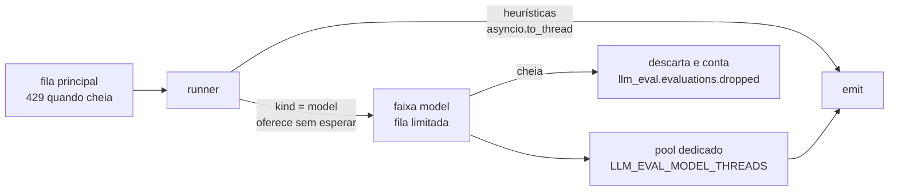

# Plano — classificadores locais

30/09/2026 · Jan Souza

## Contexto

Este plano cobre a terceira onda do Roadmap de avaliadores da [spec](../spec.md): classificadores que rodam localmente, dentro do processo do serviço, sem chamar API externa.

| Avaliador | O que detecta | Candidato |
| --- | --- | --- |
| `prompt_injection` | Injeção de prompt e jailbreak, inclusive injeção indireta em resultados de ferramenta | Llama Prompt Guard 2 86M (multilíngue) |
| `toxicity` | Resposta tóxica do modelo | Detoxify multilingual (XLM-RoBERTa), que cobre português |
| `pii_ner` | Nomes de pessoas e endereços | Presidio com modelo spaCy em português |

São os primeiros avaliadores com `kind = model`. A spec diz que os candidatos precisam ser validados em português antes de entrar, e este plano trata essa validação como uma etapa com critério de aprovação, anterior a qualquer mudança no motor.

Resultado esperado:

- Os três avaliadores, validados num conjunto em português, rodando no mesmo processo que as heurísticas.
- O `pii_ner` também serve ao juiz da [v0.3](eval-llm-judge-plan.md): mascara nomes e endereços antes do envio e pode passar a justificativa do juiz.
- As heurísticas continuam vendo 100% dos spans e mantêm a vazão medida na v0.2, mesmo com os modelos ligados e sobrecarregados.
- A imagem padrão continua pequena. Quem quer os modelos usa uma imagem separada, e os pesos não vão dentro de nenhuma das duas.

## O que a v0.3 não resolve

A v0.3 já tira os avaliadores caros do caminho das heurísticas: as faixas de execução têm fila limitada, descarte contado e drenagem no desligamento. O roadmap resume o que falta como “workers dedicados ao modelo”. Olhando o código, há três problemas concretos:

1. **Event loop.** A faixa `llm_judge` roda no event loop, o que serve para quem espera I/O. Uma inferência de modelo é trabalho de CPU; rodando ali, ela trava a ingestão e o 429.
2. **Carga do modelo.** Carregar pesos leva segundos e ocupa centenas de MB por modelo. Não há hoje um momento de carga nem um jeito de o `/readyz` esperar por ela.
3. **Dependências e pesos.** `torch`, `transformers` e `spacy` multiplicam o tamanho da imagem, e quem usa só as heurísticas não deve pagar por isso. O Prompt Guard 2 é distribuído com acesso condicionado à licença Llama no Hugging Face, e a imagem roda com sistema de arquivos somente leitura.

## Arquitetura

### Faixas de execução

Os avaliadores de modelo ganham uma faixa própria, `model`, na estrutura de faixas da v0.3: fila limitada, descarte contado, drenagem no desligamento. A diferença é que ela executa num pool de threads dedicado, e não no event loop.



Regras:

- Amostragem, exceção por serviço, corte por `max_chars`, descarte com faixa cheia (`lane_full`), drenagem no SIGTERM (`shutdown`) e `/readyz` seguem as regras da v0.3. Faixa cheia não gera 429; sob sobrecarga, o avaliador de modelo passa a avaliar uma amostra, e a métrica mostra o tamanho da perda.
- O timeout usa `asyncio.wait_for` sobre `run_in_executor`. A thread não é interrompida, mas a faixa só tem tantas tarefas em execução quanto o pool tem threads, então uma inferência presa não acumula trabalho sem limite. O evento sai com `error.type=timeout`, como hoje.

Os sinais de auto-observabilidade da v0.3 não mudam: `llm_eval.evaluations.dropped` cobre a faixa nova, e `llm_eval.lane.size` ganha o valor `model` em `llm_eval.lane`.

### Ciclo de vida do avaliador

Um protocolo opcional, separado de `Evaluator`, para quem precisa carregar algo antes de avaliar. Avaliadores que não o implementam, como as heurísticas e os de terceiros, não mudam.

```python
@runtime_checkable
class Lifecycle(Protocol):
    async def start(self) -> None: ...   # carrega o modelo; chamado antes de aceitar dados
    async def close(self) -> None: ...   # libera recursos no desligamento
```

- `Service.start` chama `start()` de cada avaliador que implementa `Lifecycle` e só depois liga `accepting`. Até lá, `/readyz` responde falha.
- Se um modelo não carrega, o processo termina com erro no log (nome da classe da exceção, como hoje). Rodar sem um avaliador habilitado esconderia a falha.
- O construtor chamado pelo entry point não importa `torch`; a importação acontece em `start()`. Assim `registry.available()` e `registry.load()` funcionam sem as dependências de modelo, e a falta delas vira `EvaluatorLoadError` com a instrução de instalar `llm-eval-otel[models]`.

### Empacotamento e pesos

- **Extra `models`** no `pyproject.toml` com `torch`, `transformers`, `presidio-analyzer` e `spacy`. `torch` vem do índice de wheels só CPU do PyTorch, declarado como índice explícito do `uv`, para não baixar as wheels com CUDA.
- **Imagem.** O `Dockerfile` ganha um alvo `models`, publicado como `:<versão>-models` pelo workflow de release. A imagem padrão não muda.
- **Pesos fora da imagem.** Um subcomando `llm-eval-otel models pull` baixa as revisões fixadas no código para `LLM_EVAL_MODEL_DIR`. No compose e no Kubernetes ele roda como serviço de uma execução só (ou init container) num volume; o serviço lê o volume com `HF_HUB_OFFLINE=1`, e o sistema de arquivos raiz continua somente leitura.
- **Prompt Guard 2.** Quem adota aceita a licença no Hugging Face e passa `HF_TOKEN` só para o `models pull`. Os pesos nunca entram em imagem publicada pelo projeto.
- **Revisão fixada.** Cada avaliador fixa o commit do modelo no Hugging Face e carrega só `safetensors`, sem pickle. O evento ganha `llm_eval.evaluator.model` (`repo@revisão`), porque `service.version` sozinho não identifica mais a regra quando o modelo pode mudar.

Configuração nova:

| Variável | Padrão | Efeito |
| --- | --- | --- |
| `LLM_EVAL_MODEL_DIR` | `/models` | onde ficam os pesos |
| `LLM_EVAL_MODEL_THREADS` | `1` | threads do pool da faixa `model` |
| `LLM_EVAL_MODEL_QUEUE_MAX` | `1000` | avaliações na faixa antes de descartar |
| `LLM_EVAL_MODEL_DEVICE` | `cpu` | `cpu` ou `cuda` |
| `LLM_EVAL_PII_NER_ALLOWLIST` | vazio | nomes que o `pii_ner` ignora, como o nome da persona do assistente |
| `LLM_EVAL_JUDGE_REDACT_NER` | `false` | mascara também nomes e endereços antes de enviar ao juiz (exige `pii_ner`) |
| `LLM_EVAL_LLM_JUDGE_SANITIZE_NER` | `false` | passa a explicação do juiz pelo `pii_ner` |

As threads internas do `torch` ficam em `cpus disponíveis // LLM_EVAL_MODEL_THREADS`, para o pool não disputar CPU com ele mesmo.

## Validação em português (etapa 1)

Nenhum avaliador entra sem passar aqui. Esta etapa não depende do motor e pode começar antes de tudo.

- **Ferramenta.** `tools/benchmark.py`, criado na v0.3 para calibrar o juiz, ganha um modo para classificador: roda o avaliador sobre um JSONL rotulado (`text`, `label`, `lang`, `location`) e relata precisão, recall, F1, taxa de falso positivo nos textos benignos, latência p50 e p99 por trecho e vazão por thread. Ele também sugere o limiar de `fail` para uma taxa de falso positivo alvo.
- **Conjuntos.** Para toxicidade, o ToLD-Br como candidato. Para injeção, um conjunto público em inglês e um conjunto em português escrito pelo time, com injeções diretas, injeções indiretas dentro de resultados de ferramenta e textos benignos parecidos com injeção (“ignore o e-mail anterior”, perguntas sobre engenharia de prompt). Para nomes e endereços, frases em português com nomes e endereços e negativos com cidades, marcas e nomes de produto. Licenças a verificar antes do uso. No repositório entram só os dados escritos pelo time; os conjuntos externos são baixados pelo script.
- **Critério de aprovação (proposta, a fechar com os primeiros números).** Em português, no limiar escolhido: precisão de 0,90 ou mais e taxa de falso positivo de até 1% nos benignos. Latência medida e registrada, sem meta fixa, porque ela define a capacidade por réplica.
- **Se reprovar.** Trocar de candidato ou adiar aquele avaliador. A interface não muda com a troca.

## Avaliadores

| | `prompt_injection` | `toxicity` | `pii_ner` |
| --- | --- | --- | --- |
| Texto avaliado | mensagens de entrada novas no turno, de usuário e de ferramenta | partes `text` das mensagens de saída | todo o conteúdo, como o `pii_detection` |
| Por quê | a injeção chega pela entrada; resultado de ferramenta é o caminho da injeção indireta | o `fail` deve apontar o comportamento da aplicação | nome e endereço são PII onde quer que apareçam |
| Score | `1 - max(P(malicioso))` entre os trechos | `1 - toxicidade` | 0.0 com ocorrência, 1.0 sem |
| `fail` | probabilidade no limiar da etapa 1 ou acima (inicial 0,5) | idem | ao menos uma ocorrência |
| Atributos | `llm_eval.prompt_injection.roles` (`user`, `tool`) | nenhum além dos comuns | `llm_eval.pii.types` (`person`, `address`) |
| Explicação | `injection p=0.97 (input, tool)` | `toxicity=0.91 (output)` | `person=2 (input), address=1 (output)` |
| `max_chars` | 20 000 | 20 000 | `None` |
| `sample_rate` | 1.0 | 1.0 | 1.0 |

Todos os três emitem também `llm_eval.evaluator.model`.

**`prompt_injection`.** O modelo aceita 512 tokens por vez. Textos maiores são divididos em janelas de 512 tokens com sobreposição de 64, e o score usa a janela pior. O classificador reconhece técnicas explícitas de injeção e jailbreak; ele não avalia se o pedido em si é nocivo. Desde a v0.2, `refusal` mostra quando o modelo recusou; cruzar os dois no painel mostra injeções que passaram. Cruzar com as notas do juiz da v0.3 no mesmo span mostra notas que podem ter sido manipuladas pelo conteúdo.

**`toxicity`.** Avalia só a saída. Toxicidade do usuário é outra pergunta (abuso contra o atendimento). Se for pedida, entra como um segundo avaliador, `toxicity_input`, que usa o mesmo modelo carregado.

**`pii_ner`.** Fica separado do `pii_detection` por três razões: custo, `kind` diferente e o fato de o `pii_detection` rodar dentro do sanitizador em cada atributo emitido. Detalhes:

- Pessoa vem da entidade `PER` do spaCy. Endereço vem de um reconhecedor de padrão do Presidio: tipo de logradouro (Rua, Av., Avenida, Travessa, Alameda, Rodovia, Praça, Estrada) seguido de nome e número, ou CEP (`\d{5}-\d{3}`) com a palavra “CEP” por perto. Entidade `LOC` sozinha não conta, porque cidade e país não identificam ninguém.
- Os reconhecedores prontos do Presidio para e-mail, cartão e telefone ficam desligados. Esses tipos são do `pii_detection`, com regras próprias.
- O sanitizador não usa NER: seria caro em cada atributo e erraria em palavras comuns. Consequência: um nome citado na explicação de um avaliador de terceiros passa pelo sanitizador. Para o juiz da v0.3 há uma opção explícita, descrita abaixo.
- `LLM_EVAL_PII_NER_ALLOWLIST` evita um `fail` por span quando as instruções de sistema trazem o nome da persona (“Sou a Ana, assistente virtual”).

**Uso pelo juiz da v0.3.** O juiz mascara PII e credenciais por regex antes de enviar, mas nomes e endereços passam. Com o `pii_ner` habilitado, duas opções reaproveitam o modelo já carregado:

- `LLM_EVAL_JUDGE_REDACT_NER` mascara nomes e endereços (`[PERSON]`, `[ADDRESS]`) no texto enviado ao juiz, ao custo de uma inferência extra por avaliação amostrada. A inferência roda no pool da faixa `model` antes de a avaliação entrar na faixa `llm_judge`.
- `LLM_EVAL_LLM_JUDGE_SANITIZE_NER` passa a justificativa do juiz pelo `pii_ner` e troca nomes e endereços por `[REDACTED]`, como o sanitizador faz com o resto.
- As duas ficam desligadas por padrão e falham na partida se o `pii_ner` não estiver habilitado.

## Testes

- **Unitários.** Cada avaliador recebe a função de classificação por injeção de dependência, e os testes usam um classificador falso e determinístico. O motor é testado com um avaliador falso lento na faixa `model`: faixa cheia, timeout, drenagem no desligamento e vazão das heurísticas.
- **Vazamento no juiz.** Com `LLM_EVAL_JUDGE_REDACT_NER=true`, o juiz falso da v0.3 não recebe os nomes e endereços dos casos sintéticos.
- **Ponta a ponta.** Um perfil `models` no `docker-compose.yaml` com a imagem `-models`, o `models pull` e casos novos no `span_generator.py`. No CI, um job separado roda `toxicity` e `pii_ner` com os pesos em cache. `prompt_injection` roda ponta a ponta só onde houver o segredo `HF_TOKEN`.
- **Carga.** `tools/load_test.py` mede a vazão das heurísticas com os três modelos ligados e a faixa saturada, e a capacidade por réplica de cada modelo em CPU.

## Etapas

1. **Validação em português.** `tools/benchmark.py`, os conjuntos e o relatório dos três candidatos.
   - Pronto quando: cada candidato tem números em português registrados neste documento e foi aprovado, trocado ou adiado.
2. **Faixa `model` e ciclo de vida.** Faixa `model` com pool de threads próprio sobre a estrutura de faixas da v0.3, `Lifecycle`, `/readyz` esperando a carga e as variáveis novas.
   - Pronto quando: com um avaliador falso de 200 ms, as heurísticas mantêm pelo menos 95% da vazão sem ele; a faixa cheia conta descarte sem gerar 429; e o timeout gera `error.type=timeout` sem afetar os outros avaliadores.
3. **Empacotamento.** Extra `models`, índice de `torch` só CPU, alvo `models` no `Dockerfile`, `llm-eval-otel models pull`, workflow de release publicando as duas imagens.
   - Pronto quando: a imagem padrão tem o mesmo tamanho da v0.3, a imagem `-models` sobe com os pesos num volume e o sistema de arquivos raiz somente leitura, e sem o extra o serviço falha com a instrução de instalação.
4. **`toxicity`.** O primeiro avaliador real, porque tem licença permissiva e é o mais simples. Ele valida o caminho inteiro.
   - Pronto quando: o avaliador reproduz no serviço os números da etapa 1 e o teste ponta a ponta encontra o evento com `llm_eval.evaluator.model`.
5. **`prompt_injection`.** Janelas de 512 tokens e leitura das mensagens de ferramenta.
   - Pronto quando: injeção direta e injeção dentro de um resultado de ferramenta dão `fail`, e os benignos da etapa 1 ficam na taxa de falso positivo aprovada.
6. **`pii_ner`.** Presidio com spaCy em português, reconhecedor de endereço, lista de exceção, `LLM_EVAL_JUDGE_REDACT_NER` e `LLM_EVAL_LLM_JUDGE_SANITIZE_NER`.
   - Pronto quando: nome e endereço dão `fail`; cidade sozinha, marca e o nome da lista de exceção dão `pass`; com as opções do juiz ligadas, o juiz falso não recebe nomes e uma justificativa com nome sai com `[REDACTED]`.
7. **Demonstração e documentação.** Perfil `models` no compose, casos no gerador, teste de carga, spec atualizada (evento, configuração, auto-observabilidade, roadmap) e README com capacidade medida por réplica, licenças dos modelos e o passo do `models pull`.
   - Pronto quando: as metas estão medidas e registradas no README.

## Critérios de aceite

- [ ] Com os três avaliadores de modelo ligados e a faixa saturada, `pii_detection` e `secret_detection` rodam em 100% dos spans e mantêm pelo menos 95% da vazão medida na v0.2.
- [ ] Faixa cheia descarta e conta em `llm_eval.evaluations.dropped`; nenhum 429 é causado pelos modelos.
- [ ] `/readyz` falha até os modelos carregarem; modelo ausente derruba o processo com erro claro no log, sem conteúdo.
- [ ] Cada avaliador passou pela validação em português, com os números registrados.
- [ ] O evento de cada avaliador de modelo traz `llm_eval.evaluator.model` com a revisão.
- [ ] Timeout ou exceção num avaliador de modelo gera evento com `error.type` e não afeta os outros.
- [ ] A imagem padrão não cresce; nenhuma imagem publicada contém pesos com acesso condicionado.
- [ ] O teste de vazamento passa com os três avaliadores novos.
- [ ] Com `LLM_EVAL_JUDGE_REDACT_NER=true`, nenhum nome ou endereço dos casos sintéticos chega ao juiz.

## Riscos

| Risco | Efeito | Mitigação |
| --- | --- | --- |
| Candidato fraco em português | Avaliador inútil ou ruidoso | Etapa 1 como condição de entrada; troca de candidato sem mudar a interface |
| Custo de CPU dos modelos | Poucas avaliações por réplica e muito descarte | Capacidade medida e publicada; `LLM_EVAL_MODEL_DEVICE=cuda`; mais réplicas; descarte visível na métrica |
| Descarte silencioso de `prompt_injection` sob carga | Injeção sem avaliação | `llm_eval.evaluations.dropped` com alerta sugerido no README |
| Licença Llama do Prompt Guard 2 | Redistribuição restrita | Pesos fora das imagens; `models pull` com o token de quem adota |
| Pesos adulterados ou trocados na origem | Código arbitrário ou regra diferente | Revisão fixada por commit; só `safetensors` |
| `torch` e `transformers` mudam rápido | Quebra num upgrade | Versões fixadas no `uv.lock`; teste de reprodução dos números da etapa 1 no CI dos modelos |
| Memória por réplica | Imagem `-models` exige mais RAM | Consumo medido e publicado no README |

## Decisões em aberto

- **Detoxify como pacote ou checkpoint direto.** O pacote `detoxify` fixa versões próprias de `transformers`. Carregar o checkpoint direto com `transformers` evita o conflito. Recomendação: decidir na etapa 1 pelo caminho que fixar menos dependências.
- **Microlotes.** Juntar trechos de interações diferentes numa chamada ao modelo aumenta a vazão, sobretudo em GPU, mas complica o timeout por avaliação. Recomendação: só fazer se a etapa 7 mostrar necessidade.
- **`toxicity_input`.** Entra só se alguém pedir.
