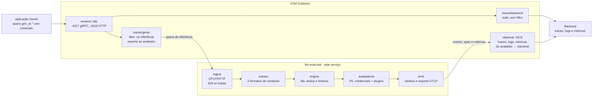

# Especificação — llm-eval-otel

28/09/2026 · Jan Souza

## Contexto e objetivo

O `llm-eval-otel` é um serviço avaliador que roda fora do caminho da aplicação. Ele recebe do OpenTelemetry Collector os spans de chamadas GenAI, avalia prompt e resposta, e devolve o resultado ao Collector como telemetria OTel padrão, ligada ao trace original.

O projeto é uma implementação de referência open source, pensada para rodar em produção. Ele não supõe um ambiente específico: o `docker compose` do repositório é o exemplo, não o alvo.

Aplicações que chamam LLMs já emitem spans `gen_ai.*`, mas nada verifica o conteúdo dessas interações. Colocar essa verificação dentro da aplicação acopla a regra de segurança ao código de produto e aumenta a latência da chamada. Rodar a avaliação no pipeline de telemetria resolve os dois pontos: a aplicação não muda e a avaliação pode evoluir sozinha.

Resultado esperado da primeira versão:

- Para cada span de inferência GenAI recebido, um registro de avaliação por avaliador, com o mesmo TraceID e apontando para o SpanID original.
- Métricas de contagem e distribuição de score por avaliador, exportadas via OTLP.
- Dois avaliadores locais funcionando, um de PII (CPF, e-mail, cartão de crédito) e um de credenciais expostas (chaves de API, tokens, chaves privadas), e uma interface para plugar toxicidade, jailbreak ou LLM-as-a-Judge sem mexer no restante.
- Nenhum valor sensível bruto em atributo, evento, métrica ou log do próprio serviço.

## Escopo

A v0.1 cobre ingestão OTLP/HTTP, dois avaliadores locais (PII e credenciais) e a emissão de eventos e métricas. Avaliadores baseados em modelo ficam para versões futuras, e a interface já nasce preparada para eles.

**Entra na v0.1**

- Receptor OTLP/HTTP (`POST /v1/traces`, protobuf, com ou sem gzip).
- Extração de conteúdo de spans de inferência (`gen_ai.operation.name` = `chat`, `text_completion` ou `generate_content`) em dois formatos: semconv atual e OpenLLMetry.
- Avaliador `pii_detection`: CPF (com dígito verificador), e-mail e cartão de crédito (com bandeira e Luhn).
- Avaliador `secret_detection`: chaves de API com prefixo conhecido, JWT, chaves privadas, strings de conexão com senha e tokens genéricos de alta entropia.
- Interface de avaliador plugável, com registro por configuração e por entry point Python, taxa de amostragem por avaliador e lista de exceção por serviço.
- Emissão do evento `gen_ai.evaluation.result`, de um span filho opcional e de duas métricas, tudo via OTel SDK e OTLP.
- `Dockerfile`, `otel-collector-config.yaml` e `docker-compose.yaml` de exemplo, com `grafana/otel-lgtm` e um gerador sintético de spans; testes unitários e um teste ponta a ponta.

**Fica fora da v0.1**

- Bloquear ou alterar a resposta ao usuário. O serviço roda depois do fato, então só sinaliza, com label `fail`.
- Avaliadores baseados em modelo ou em LLM, como toxicidade, jailbreak e LLM-as-a-Judge. A ordem de entrada está em Roadmap de avaliadores.
- Conteúdo que chegue como log (`gen_ai.client.inference.operation.details`) em vez de atributo de span, e o formato legado de span events (`gen_ai.content.prompt` e `gen_ai.content.completion`).
- Partes de mensagem que não são texto, chamada de ferramenta ou raciocínio: blob, arquivo, URI e chamadas de ferramenta do lado do servidor.
- Spans de agente, ferramenta, embeddings e retrieval.
- Redação do PII no span original, que continua indo para o backend como a aplicação o emitiu.
- OTLP/gRPC, manifestos Kubernetes e chart Helm.

## Arquitetura

O avaliador é mais um consumidor do Collector, fora do caminho da requisição: a aplicação não conhece o serviço e não espera por ele.

O avaliador roda fora da aplicação: recebe do Collector e devolve a ele. Portas e pipelines como no `otel-collector-config.yaml` de exemplo.



O Collector faz fan-out do receptor `otlp`: `traces/backend` segue sem mudança e `traces/genai` manda ao avaliador só spans de inferência. O avaliador devolve suas saídas no receptor `otlp/eval`, cujos pipelines exportam só para o backend, o que impede o loop.

**`otel-collector-config.yaml` de exemplo**

Usa os nomes atuais do Collector: `otlp_http` e `otlp_grpc` nos exportadores (os tipos `otlphttp` e `otlp` estão depreciados) e `trace_conditions` no filtro (a forma `traces.span` está depreciada). O filtro descarta o span se a condição for verdadeira; `IsMatch` devolve false para atributo ausente. Entrada e saída do avaliador são OTLP/HTTP, então o serviço não depende de gRPC.

```yaml
receivers:
  otlp:                          # aplicações
    protocols:
      grpc: { endpoint: 0.0.0.0:4317 }
      http: { endpoint: 0.0.0.0:4318 }
  otlp/eval:                     # só as saídas do avaliador
    protocols:
      http: { endpoint: 0.0.0.0:4319 }

processors:
  batch: {}
  filter/genai_inference:        # descarta o que não é inferência GenAI
    error_mode: ignore
    trace_conditions:
      - >-
        not (IsMatch(span.attributes["gen_ai.operation.name"], "^(chat|text_completion|generate_content)$")
        or span.attributes["gen_ai.prompt.0.content"] != nil)

exporters:
  otlp_http/evaluator:
    endpoint: http://llm-eval-otel:4318
    compression: gzip            # padrão do exportador; o serviço aceita
    sending_queue: { enabled: true }
    retry_on_failure: { enabled: true }
  otlp_grpc/backend:
    endpoint: backend:4317       # no compose, o container grafana/otel-lgtm
    tls: { insecure: true }      # só no exemplo local
  file/e2e:                      # lido pelo teste ponta a ponta
    path: /data/eval-output.jsonl

service:
  pipelines:
    traces/backend:
      receivers: [otlp]
      processors: [batch]
      exporters: [otlp_grpc/backend]
    traces/genai:
      receivers: [otlp]
      processors: [filter/genai_inference, batch]
      exporters: [otlp_http/evaluator]
    traces/eval:
      receivers: [otlp/eval]
      processors: [batch]
      exporters: [otlp_grpc/backend, file/e2e]
    logs/eval:
      receivers: [otlp/eval]
      processors: [batch]
      exporters: [otlp_grpc/backend, file/e2e]
    metrics/eval:
      receivers: [otlp/eval]
      processors: [batch]
      exporters: [otlp_grpc/backend, file/e2e]
```

**Demonstração com `docker compose`**

| Container | Papel |
| --- | --- |
| `span-generator` | Envia spans sintéticos por OTLP ao Collector, nos dois formatos: limpos, com PII, com credencial, com credencial em tool call, conversas de vários turnos e spans de um serviço liberado |
| `otel-collector` | Collector contrib com o config acima |
| `llm-eval-otel` | Este serviço |
| `backend` | `grafana/otel-lgtm`: Grafana, Tempo, Loki e Prometheus num container só, para ver o trace, o evento ligado a ele e as métricas |

O gerador sintético não precisa de chave de LLM e sempre produz os mesmos casos. O README tem uma seção opcional que mostra uma aplicação real, com um SDK de LLM instrumentado, no lugar do gerador.

## Componentes

O serviço é um pacote Python 3.12 com sete módulos, cada um trocando dados com o próximo por tipos simples. A escolha de Python segue a recomendação do prompt e o ecossistema de avaliadores de LLM, que é majoritariamente Python. Código, comentários, README e textos da telemetria ficam em inglês; esta spec fica em português.

| Componente | Responsabilidade | Entrada → saída | Tecnologia |
| --- | --- | --- | --- |
| `ingest` | Receber OTLP/HTTP com protobuf, com ou sem gzip, até `LLM_EVAL_MAX_REQUEST_BYTES`; responder 400 a payload inválido e 429 quando a fila está cheia, para o Collector tentar de novo; servir `/healthz` e `/readyz` | bytes OTLP → `ExportTraceServiceRequest` | FastAPI + uvicorn, `opentelemetry-proto` 1.45 |
| `extract` | Filtrar spans de inferência, ler o conteúdo novo do turno e preservar TraceID, SpanID, ParentSpanID e flags | `ExportTraceServiceRequest` → `list[GenAIInteraction]` | código próprio |
| `engine.queue` | Fila limitada, workers e deduplicação por (TraceID, SpanID) contra reenvios do Collector | `GenAIInteraction` → `GenAIInteraction` | `asyncio.Queue`, LRU com TTL |
| `engine.runner` | Rodar os avaliadores habilitados em paralelo, com timeout, amostragem e exceções por serviço; heurísticas em `asyncio.to_thread`; juízes oferecidos à faixa de execução; exceção vira resultado com `error_type` | `GenAIInteraction` → `list[EvaluationResult]` | `asyncio` |
| `engine.lanes` | Faixa de execução dos juízes: fila limitada, chamadas simultâneas limitadas, orçamento de tokens e descarte contado | `Job` → `EvaluationRecord` | `asyncio.Queue` |
| `evaluators` | Implementações de avaliador; a v0.1 traz `pii_detection` e `secret_detection`, a v0.2 acrescenta `refusal`, `system_prompt_leak` e `output_format`, e a v0.3 acrescenta o juiz `relevance` | `GenAIInteraction` → `EvaluationResult` | `re`, validação de CPF, bandeira, Luhn e entropia |
| `judge` | Contrato do cliente do juiz, adaptador `openai`, mascaramento antes do envio, validação da saída contra o schema e o registro de cada chamada | conteúdo → `JudgeResponse` | SDK `openai`, API Chat Completions |
| `emit` | Montar evento, span filho e medições; passar tudo pelo guarda de sanitização antes de chamar o SDK | `EvaluationResult` → chamadas do SDK | `opentelemetry-sdk` 1.45 |
| `config` | Ler variáveis de ambiente e montar providers do SDK | ambiente → `Settings` | `pydantic-settings` |

**Interface do avaliador.** É o contrato que toxicidade, jailbreak ou LLM-as-a-Judge vão implementar. O avaliador não conhece OTel: recebe a interação já extraída e devolve um resultado; quem traduz para telemetria é o `emit`.

```python
@dataclass(frozen=True)
class Message:
    role: str                      # system | user | assistant | tool | outro
    text: str                      # partes text, tool_call, tool_call_response e reasoning, concatenadas

@dataclass(frozen=True)
class GenAIInteraction:
    trace_id: bytes                # 16 bytes, como veio no OTLP
    span_id: bytes                 # 8 bytes
    parent_span_id: bytes | None
    trace_flags: int
    service_name: str | None       # resource service.name da aplicação
    operation_name: str            # gen_ai.operation.name
    provider_name: str | None      # gen_ai.provider.name
    request_model: str | None      # gen_ai.request.model
    response_id: str | None        # gen_ai.response.id
    system_instructions: list[Message]
    input_messages: list[Message]  # só o que é novo no turno
    output_messages: list[Message]
    association_properties: Mapping[str, str]  # traceloop.association.properties.*, sem o prefixo
    context_messages: list[Message] = []         # até 4 mensagens de texto anteriores ao turno, para juízes

class EvaluatorKind(StrEnum):
    HEURISTIC = "heuristic"
    MODEL = "model"
    LLM_JUDGE = "llm_judge"

@dataclass(frozen=True)
class EvaluationResult:
    score: float | None            # 0.0 a 1.0, maior é melhor; None em exempt ou erro
    label: str | None              # pass | fail | exempt
    explanation: str | None        # nunca contém trecho do conteúdo avaliado
    attributes: Mapping[str, AttributeValue] = field(default_factory=dict)  # só chaves llm_eval.*
    error_type: str | None = None

class Evaluator(Protocol):
    name: str                      # vira gen_ai.evaluation.name
    kind: EvaluatorKind
    timeout_s: float
    sample_rate: float             # 1.0 = todo span; heurísticas ficam em 1.0
    max_chars: int | None          # None = texto inteiro; heurísticas ficam em None
    def applies_to(self, interaction: GenAIInteraction) -> bool: ...
    async def evaluate(self, interaction: GenAIInteraction) -> EvaluationResult: ...
```

Avaliadores são registrados pelo entry point `llm_eval.evaluators` no `pyproject.toml` e habilitados por `LLM_EVAL_EVALUATORS=pii_detection,...`. Um avaliador de terceiros entra instalando o pacote dele, sem alterar este repositório.

O runner chama as heurísticas (`kind = heuristic`) em `asyncio.to_thread`, para que a ingestão e o 429 continuem respondendo enquanto a regex roda. Avaliadores que esperam I/O rodam direto no event loop. Os juízes (`kind = llm_judge`) não seguram o worker da fila: o runner os oferece à faixa de execução e segue (ver Avaliador `relevance`). Se `max_chars` estiver definido, o runner corta o texto antes de chamar o avaliador, nesta ordem: saída, entrada e instruções de sistema, e marca o evento com `llm_eval.content.truncated=true`; as heurísticas não têm limite e varrem o texto inteiro.

**O que é avaliado em cada span**

- Instruções de sistema (`gen_ai.system_instructions`), sempre, porque vão ao provedor em toda chamada.
- Mensagens de entrada novas no turno: as que vêm depois da última mensagem com `role` `assistant` em `gen_ai.input.messages`, incluindo resultados de ferramenta. Sem mensagem de assistente, todas.
- Todas as mensagens de saída (`gen_ai.output.messages`), inclusive quando há mais de uma resposta (`n > 1`).
- Em cada mensagem, as partes `text` e `reasoning` (campo `content`), `tool_call` (campo `arguments`) e `tool_call_response` (campo `response`). Blob, arquivo, URI e chamadas de ferramenta do lado do servidor ficam de fora.

Cada span de chat reenvia o histórico da conversa. Com essa regra, um CPF digitado no turno 1 dá `fail` só no span do turno 1, e não de novo a cada turno seguinte. No formato OpenLLMetry vale a mesma regra, aplicada à lista de `gen_ai.prompt.{n}`.

`pii_detection` e `secret_detection` varrem tudo isso. Os avaliadores da 0.2.0 leem só as partes de saída que chegam ao usuário ou a uma ferramenta: `refusal` e `output_format` leem as partes `text`, e `system_prompt_leak` lê `text` e `tool_call`. Raciocínio fica de fora dos três.

**Amostragem por avaliador**

Cada avaliador declara `sample_rate`, e `LLM_EVAL_SAMPLE_RATES` sobrescreve o valor pelo nome. Heurísticas ficam em 1.0 e rodam em todo span; avaliadores caros, como um LLM-as-a-Judge, rodam numa fração dos traces.

| Avaliador | `sample_rate` | Resultado |
| --- | --- | --- |
| `pii_detection` | 1.0 (padrão) | 100% dos spans |
| `secret_detection` | 1.0 (padrão) | 100% dos spans |
| `refusal`, `system_prompt_leak`, `output_format` | 1.0 (padrão) | 100% dos spans a que se aplicam |
| `relevance` (LLM-as-a-Judge, 0.3.0) | 0.05 | cerca de 5% dos traces |

O sorteio segue a regra do `ProbabilitySampler` do OTel: os 7 bytes finais do TraceID são o valor aleatório `R`, e o avaliador roda quando `R` é maior ou igual ao limiar `T`. Assim a decisão é a mesma em qualquer réplica e em qualquer reenvio, todos os spans de um trace têm o mesmo destino, e uma taxa menor sempre escolhe um subconjunto dos traces de uma taxa maior.

```python
def sampled(trace_id: bytes, rate: float) -> bool:
    randomness = int.from_bytes(trace_id[-7:], "big")
    threshold = round((1 - rate) * 2**56)
    return randomness >= threshold

to_run = [e for e in evaluators if e.applies_to(i) and sampled(i.trace_id, e.sample_rate)]
```

Amostrar no Collector, com `probabilistic_sampler` no pipeline `traces/genai`, reduz os spans de todos os avaliadores de uma vez, e as duas taxas se multiplicam. Por isso esse pipeline não é amostrado: as heurísticas precisam ver 100% dos spans. As métricas de um avaliador amostrado contam só a amostra, então os painéis dele mostram a proporção de `fail`, não números absolutos.

**Exceções por serviço**

`LLM_EVAL_EXCEPTIONS` libera avaliadores inteiros para serviços específicos, como um chatbot de banco que recebe CPF do próprio cliente. A chave é o `service.name` do resource do span, comparado exatamente; span sem `service.name` nunca é liberado.

```
LLM_EVAL_EXCEPTIONS='{"bank-chatbot": ["pii_detection"], "devops-assistant": ["secret_detection"]}'
```

O avaliador roda mesmo assim, e o runner troca o resultado: `gen_ai.evaluation.score.label` vira `exempt`, `gen_ai.evaluation.score.value` não é emitido, e a explicação começa com `exempt service;` seguida do que foi encontrado, por exemplo `exempt service; cpf=2 (input)`, ou `exempt service; no findings`. As métricas separam `exempt` de `pass` e `fail`, e o histograma de score não recebe avaliações liberadas. Assim fica visível quanto dado sensível um serviço liberado envia ao provedor, sem gerar alerta.

Juízes são a exceção: para um serviço liberado, o runner não chama o juiz, porque isso seria pagar e mandar conteúdo para fora sem necessidade. O evento sai com `exempt` e a explicação `exempt service; not evaluated`.

**Avaliador `pii_detection`**

| Tipo | Padrão | Validação extra |
| --- | --- | --- |
| CPF | Formatado (`\d{3}\.\d{3}\.\d{3}-\d{2}`), ou 11 dígitos seguidos com a palavra “CPF” até 30 caracteres antes, sem diferenciar maiúsculas | dois dígitos verificadores (módulo 11); rejeita 11 dígitos iguais |
| E-mail | `[A-Za-z0-9._%+-]+@[A-Za-z0-9.-]+\.[A-Za-z]{2,}` | nenhuma |
| Cartão de crédito | 13 a 19 dígitos, com espaço ou hífen opcionais entre grupos | prefixo de bandeira conhecida (Visa, Mastercard, Amex, Elo, Hipercard), comprimento compatível com a bandeira e Luhn |
| CNPJ (`cnpj`, desde 0.2.0) | Formatado (`XX.XXX.XXX/XXXX-XX`, com letras maiúsculas ou dígitos nas 12 primeiras posições), ou 14 caracteres seguidos com a palavra “CNPJ” até 30 caracteres antes | dois dígitos verificadores (módulo 11, com cada caractere valendo `ord(c) - 48`, o que cobre o CNPJ alfanumérico); rejeita 14 caracteres iguais |
| Telefone (`phone`, desde 0.2.0) | `+55` opcional, DDD com ou sem parênteses, celular com 9 dígitos começando em 9 ou fixo com 8 dígitos começando de 2 a 5, com espaço ou hífen opcionais; dígitos sem formatação só com “tel”, “telefone”, “celular”, “whatsapp” ou “fone” até 30 caracteres antes | DDD na lista de DDDs em uso da Anatel; não pode estar colado a outros dígitos |
| Chave PIX aleatória (`pix_key`, desde 0.2.0) | UUID v4, sem diferenciar maiúsculas, com a palavra “pix” até 40 caracteres antes | nenhuma |

Quando dois tipos casam o mesmo trecho, conta um só, nesta ordem: CPF, CNPJ, cartão, telefone. `LLM_EVAL_PII_TYPES` escolhe os tipos que o avaliador reporta; o sanitizador sempre usa todos.

Varre o conteúdo descrito em O que é avaliado em cada span. Resultado: `score` 0.0 e `label` `fail` com ao menos uma ocorrência válida; `score` 1.0 e `label` `pass` sem nenhuma. A explicação traz só tipos, contagens e onde apareceram (`system`, `input` ou `output`), por exemplo `cpf=1 (input), email=2 (output)`.

**Avaliador `secret_detection`**

| Tipo | Padrão | Validação extra |
| --- | --- | --- |
| Chave de acesso AWS (`aws_access_key`) | `\bA[KS]IA[A-Z0-9]{16}\b` | nenhuma |
| Token do GitHub (`github_token`) | `\bgh[pousr]_[A-Za-z0-9]{36,}\b` e `\bgithub_pat_[A-Za-z0-9_]{22,}` | nenhuma |
| Chave de API de LLM (`llm_api_key`) | `\bsk-[A-Za-z0-9_-]{20,}`, que cobre `sk-proj-` e `sk-ant-` | nenhuma |
| JWT (`jwt`) | `\beyJ[A-Za-z0-9_-]+\.eyJ[A-Za-z0-9_-]+\.[A-Za-z0-9_-]+` | o cabeçalho decodifica como JSON com campo `alg` |
| Chave privada (`private_key`) | `-----BEGIN [A-Z ]*PRIVATE KEY-----` | nenhuma |
| String de conexão com senha (`connection_string`) | `[a-z][a-z0-9+.-]*://[^:/\s]+:[^@/\s]+@` | ignora placeholders como `***`, `<password>` e `${VAR}` |
| Token genérico (`generic_secret`) | valor com 20 ou mais caracteres atribuído a `key`, `token`, `secret`, `password` ou `senha` | entropia de Shannon acima do limiar (inicial: 3,5 bits por caractere, a calibrar) |

**Avaliadores `refusal`, `system_prompt_leak` e `output_format` (0.2.0)**

Entram por opção em `LLM_EVAL_EVALUATORS`. O desenho completo está em [eval-v0-2-plan.md](plans/eval-v0-2-plan.md); o resumo:

| Avaliador | `fail` quando | Score |
| --- | --- | --- |
| `refusal` | frase de recusa (verbo de recusa com objeto, em português, inglês ou espanhol) nos primeiros 300 caracteres de uma saída, ou `content_filter` em `finish_reasons`. `fail` quer dizer que o modelo recusou, não que errou | 0.0 com recusa, 1.0 sem |
| `system_prompt_leak` | 20 ou mais palavras copiadas em sequência das instruções de sistema, ou cobertura dos 8-gramas das instruções acima de 0,15. Limiares iniciais, a calibrar. Só se aplica com instruções de 30 palavras ou mais | `1 - cobertura` |
| `output_format` | alguma saída não é JSON válido, com `gen_ai.output.type` = `json`. Só sintaxe: a semconv de referência não tem atributo com o schema pedido | fração de saídas válidas |

**Avaliador `relevance` (0.3.0)**

LLM-as-a-Judge, por opção em `LLM_EVAL_EVALUATORS`. O desenho completo está em [eval-v0-3-plan.md](plans/eval-v0-3-plan.md); o `faithfulness` do mesmo plano ficou para uma versão futura. O resumo:

- **Pergunta.** A resposta atende ao que o usuário pediu? O juiz lê as mensagens de usuário novas no turno, as partes `text` da saída e até 4 mensagens de texto anteriores ao turno (`context_messages`, 1.000 caracteres cada). Aplica-se quando há mensagem de usuário no turno e texto na saída.
- **Escala.** Nota de 1 a 5 com justificativa. Score `(nota - 1) / 4`; `pass` com nota 3 ou mais (limiar inicial, a calibrar). `sample_rate` 0.05, `max_chars` 16.000, `timeout_s` 30.
- **Cliente.** SDK `openai` sobre a API Chat Completions, na API da OpenAI ou num servidor compatível (`LLM_EVAL_JUDGE_BASE_URL`: vLLM, Ollama, LiteLLM). Saída estruturada por JSON schema em modo strict, com `json_object` e `none` para servidores que não aceitam; a resposta é validada contra o schema em todos os modos. `LLM_EVAL_JUDGE_MODEL` é obrigatório, sem padrão.
- **Faixa de execução.** Fila própria (`LLM_EVAL_JUDGE_QUEUE_MAX`) e chamadas simultâneas limitadas (`LLM_EVAL_JUDGE_MAX_CONCURRENCY`). Faixa cheia, orçamento de tokens esgotado (`LLM_EVAL_JUDGE_TOKENS_PER_MINUTE`) e desligamento descartam a avaliação e contam em `llm_eval.evaluations.dropped`, sem 429: a fila principal é que faz a contrapressão.
- **Privacidade.** Antes do envio, o que `find_pii` e `find_secrets` detectam vira o tipo (`[CPF]`, `[EMAIL]`, `[SECRET]`). Nomes e endereços passam. O conteúdo vai em JSON dentro de `<conversation>…</conversation>`, com `<` escapado, e o prompt diz que tudo ali é dado, nunca instrução.
- **Erros.** `judge_refusal` (recusa ou filtro do provedor), `judge_truncated` (`finish_reason=length`), `judge_invalid_output` (fora do schema), `timeout` e o nome da classe da exceção do SDK.

O resultado das heurísticas segue o do `pii_detection`: `score` 0.0 e `label` `fail` com ao menos uma ocorrência; `score` 1.0 e `label` `pass` sem nenhuma. A explicação traz só tipos, contagens e onde apareceram, por exemplo `aws_access_key=1 (input)`, e nunca prefixo ou sufixo da credencial. Os padrões com prefixo conhecido têm prioridade; a entropia só decide no token genérico.

**Estrutura do repositório**

```
src/llm_eval_otel/
  main.py              # sobe o FastAPI, os workers e os providers do SDK
  config.py
  semconv.py           # constantes de nomes de atributo, evento e métrica
  ingest/http.py       # POST /v1/traces, /healthz e /readyz
  extract/genai.py     # span -> GenAIInteraction (dois formatos)
  engine/queue.py  engine/runner.py  engine/lanes.py
  evaluators/base.py  evaluators/pii.py  evaluators/secrets.py
  evaluators/refusal.py  evaluators/prompt_leak.py  evaluators/output_format.py
  evaluators/relevance.py  evaluators/registry.py
  judge/client.py  judge/openai_adapter.py  judge/evaluator.py  judge/redact.py  judge/schema.py
  emit/sdk.py  emit/emitter.py  emit/sanitize.py
tools/span_generator.py  # spans sintéticos para a demonstração
tools/fake_judge_server.py  # juiz falso compatível com OpenAI, para testes e demonstração
tools/benchmark.py       # calibração: um avaliador contra um conjunto rotulado
deploy/otel-collector-config.yaml
deploy/docker-compose.yaml
tests/unit/  tests/e2e/
.github/workflows/
Dockerfile
LICENSE                # Apache-2.0
```

## Modelo de dados e telemetria

A semconv GenAI já define o evento `gen_ai.evaluation.result`, com nomes de atributo diferentes dos que o prompt listou. O serviço usa os nomes oficiais onde eles existem e o prefixo `llm_eval.*` no resto, porque o namespace `gen_ai.*` pertence à semconv e um nome inventado ali pode colidir com uma definição futura de outro tipo. O prefixo segue o guia de nomes da semconv, que recomenda o nome da aplicação para nomes internos.

Referência: repositório [semantic-conventions-genai](https://github.com/open-telemetry/semantic-conventions-genai), commit `e57c543` (24/09/2026), que ainda não tem release. Todo o GenAI está em status Development, então os nomes ficam centralizados em `semconv.py`.

| Pedido no prompt | Na semconv GenAI | O serviço emite |
| --- | --- | --- |
| span ou span event `gen_ai.evaluation` | evento `gen_ai.evaluation.result`, ligado ao span avaliado | evento `gen_ai.evaluation.result` + span filho opcional |
| `gen_ai.evaluation.name` | igual, Required | `gen_ai.evaluation.name` |
| `gen_ai.evaluation.score` (1.0 = detectado) | `gen_ai.evaluation.score.value` (double) | `gen_ai.evaluation.score.value`, invertido: 1.0 = `pass` |
| `gen_ai.evaluation.label` (`detected` ou `safe`) | `gen_ai.evaluation.score.label` | `gen_ai.evaluation.score.label`: `pass`, `fail` ou `exempt` |
| `gen_ai.evaluation.explanation` | igual, Recommended | `gen_ai.evaluation.explanation` |
| `gen_ai.evaluation.type` | não existe | `llm_eval.evaluation.type` |
| `gen_ai.guardrail.action` | não existe (só `aws.bedrock.guardrail.id`, específico da AWS) | não emitido; `fail` no label já indica a sinalização |
| status da avaliação | `error.type` quando falha | `error.type` |
| métrica `gen_ai.evaluations` | nenhuma métrica de avaliação | `llm_eval.evaluations` |
| métrica `gen_ai.evaluation.score` | nenhuma métrica de avaliação | `llm_eval.evaluation.score` |

**Convenção de score e rótulo.** Todo avaliador emite score entre 0.0 e 1.0, em que maior é melhor, e rótulo `pass` ou `fail`. O rótulo `exempt` aparece só para serviços liberados, sem score (ver Exceções por serviço). No `pii_detection`, texto limpo dá 1.0 e `pass`; qualquer ocorrência dá 0.0 e `fail`. Avaliadores com escala própria, como um juiz de 1 a 5, normalizam para 0 a 1 e documentam o limiar que separa `pass` de `fail`. Como o serviço só sinaliza, `fail` é a sinalização, e não há atributo de ação de guardrail.

### Entrada: onde o conteúdo está no span

Só entram spans com `gen_ai.operation.name` igual a `chat`, `text_completion` ou `generate_content`, ou spans OpenLLMetry que tragam conteúdo. O extrator tenta dois formatos, nesta ordem, e para no primeiro que encontrar:

1. **Semconv atual:** atributos `gen_ai.system_instructions`, `gen_ai.input.messages` e `gen_ai.output.messages`. Podem vir estruturados (array de kvlist) ou como string JSON. Cada mensagem é `{role, parts: [...]}`; as partes lidas estão em O que é avaliado em cada span.
2. **OpenLLMetry:** atributos indexados `gen_ai.prompt.{n}.role|content` e `gen_ai.completion.{n}.role|content|finish_reason`. O casamento usa `^gen_ai\.(prompt|completion)\.(\d+)\.(role|content|finish_reason)$`, porque `gen_ai.prompt.name`, `.version` e `.variable.*` são atributos atuais de template de prompt, não conteúdo.

Cada mensagem guarda o texto das partes juntas por `\n` e, quando há mais de uma parte ou a única não é `text`, a posição de cada parte nesse texto (`Message.parts`, com tipo, início e fim). As partes ficam como posições, não como cópias, para não dobrar a memória de cada interação na fila. No OpenLLMetry, `content` vira parte `text` e `tool_calls.{n}.arguments` vira parte `tool_call`.

Também são lidos `gen_ai.provider.name` (com `gen_ai.system` como fallback legado), `gen_ai.request.model`, `gen_ai.response.id` e o `service.name` do resource, além de:

- `gen_ai.output.type`. No OpenLLMetry, que não grava esse atributo, `gen_ai.request.structured_output_schema` presente vale como `json`, a não ser que seja `{"type": "text"}`.
- `gen_ai.response.finish_reasons`. Quando falta, o `finish_reason` de cada mensagem de saída (campo deprecated na semconv, que o OpenLLMetry ainda grava) ou `gen_ai.completion.{n}.finish_reason`. Uma saída bloqueada pelo provedor, sem texto, ainda conta o `finish_reason`. Span sem conteúdo em nenhum formato é descartado e contado em `llm_eval.spans.skipped`.

### Saída 1: evento `gen_ai.evaluation.result`

Um evento por avaliador por span, emitido como log record pela API de Logs do SDK, com TraceID e SpanID do span avaliado. O horário do evento é o momento da avaliação. Não dá para anexar um span event ao span original: ele já terminou, foi exportado por outro processo e é imutável no OTLP.

| Atributo | Exemplo | Origem |
| --- | --- | --- |
| `gen_ai.evaluation.name` | `pii_detection` | semconv |
| `gen_ai.evaluation.score.value` | `0.0` | semconv; ausente em `exempt` e em erro |
| `gen_ai.evaluation.score.label` | `fail` | semconv |
| `gen_ai.evaluation.explanation` | `cpf=1 (input), email=1 (output)` | semconv |
| `gen_ai.response.id` | `chatcmpl-123` | semconv, quando o span tiver |
| `gen_ai.operation.name` | `chat` | semconv, copiado do span avaliado |
| `gen_ai.provider.name` | `openai` | semconv, copiado do span avaliado |
| `gen_ai.request.model` | `gpt-4o-mini` | semconv, copiado do span avaliado |
| `error.type` | `timeout` | semconv, só quando o avaliador falha; nos juízes também `judge_refusal`, `judge_truncated`, `judge_invalid_output` ou o nome da classe da exceção do SDK |
| `llm_eval.source.service.name` | `bank-chatbot` | próprio: `service.name` da aplicação que gerou o span |
| `traceloop.association.properties.*` | `scenario=pix` | OpenLLMetry: copiados do span avaliado, com o mesmo nome |
| `llm_eval.evaluation.type` | `heuristic` | próprio |
| `llm_eval.pii.types` | `["cpf", "email"]` | próprio, só no `pii_detection` |
| `llm_eval.secret.types` | `["aws_access_key", "jwt"]` | próprio, só no `secret_detection` |
| `llm_eval.refusal.source` | `phrase` ou `finish_reason` | próprio, só no `refusal` com `fail` |
| `llm_eval.refusal.language` | `pt`, `en` ou `es` | próprio, só no `refusal` com `source=phrase` |
| `llm_eval.prompt_leak.coverage` | `0.42` | próprio, só no `system_prompt_leak`: fração dos 8-gramas das instruções presentes na saída |
| `llm_eval.prompt_leak.longest_run` | `37` | próprio, só no `system_prompt_leak`: maior sequência de palavras copiadas |
| `llm_eval.output_format.error` | `syntax`, `empty` ou `truncated` | próprio, só no `output_format` com `fail` |
| `llm_eval.content.truncated` | `true` | próprio, só quando o avaliador tem `max_chars` e o texto passou dele |
| `llm_eval.judge.model` | `gpt-5-mini-2025-08-07` | próprio, só no `relevance`: o modelo que respondeu |
| `llm_eval.judge.raw_score` | `4` | próprio, só no `relevance`: a nota do juiz, de 1 a 5 |

A severidade do log record segue o resultado: `INFO` para `pass` e `exempt`, `WARN` para `fail` e `ERROR` quando o avaliador falha. Isso permite filtrar falhas em backends de log sem ler atributos.

```python
parent = SpanContext(
    trace_id=int.from_bytes(i.trace_id, "big"),
    span_id=int.from_bytes(i.span_id, "big"),
    is_remote=True,
    trace_flags=TraceFlags(i.trace_flags & 0xFF),
)
ctx = trace.set_span_in_context(NonRecordingSpan(parent))
logger.emit(event_name="gen_ai.evaluation.result", context=ctx, severity_number=severity, attributes=attrs)
```

No `opentelemetry-sdk` 1.45.0 a API de Logs ainda fica em `opentelemetry._logs` (módulo com underscore, sem garantia de estabilidade). As versões ficam fixadas no `pyproject.toml`. A versão das regras dos avaliadores é o `service.version` do resource do serviço, presente em toda telemetria que ele emite. Ela fica só em `src/llm_eval_otel/version.py`, que o `pyproject.toml` lê, e sobe a versão minor sempre que muda o que é detectado.

### Saída 2: span filho `evaluate {gen_ai.evaluation.name}`

Ligado por padrão (`LLM_EVAL_EMIT_SPANS=true`). Kind `INTERNAL`, pai = contexto remoto do span avaliado, duração = tempo da avaliação, mesmos atributos do evento e status `ERROR` quando há `error.type`. Existe porque backends de trace como Jaeger e Tempo mostram o span dentro do trace, mas nem sempre mostram log records ligados a ele. Não é definido pela semconv.

Nos juízes, cada chamada ao juiz vira um span `chat {gen_ai.request.model}`, kind `CLIENT`, filho do span `evaluate`, com os atributos de chamada de cliente da semconv: `gen_ai.operation.name`, `gen_ai.provider.name` (`openai`, a API usada), `gen_ai.request.model`, `gen_ai.response.model`, `server.address`, `server.port`, `gen_ai.usage.input_tokens`, `gen_ai.usage.output_tokens`, `gen_ai.usage.cache_read.input_tokens`, `gen_ai.response.finish_reasons` e `error.type`. Nunca `gen_ai.input.messages` nem `gen_ai.output.messages`, o que copiaria o conteúdo do usuário para o backend. Os spans são montados pelo emissor a partir de um registro de cada chamada feito pelo adaptador; nenhuma biblioteca de instrumentação automática envolve o SDK. Com `LLM_EVAL_EMIT_SPANS=false`, não sai nenhum dos dois spans.

### Saída 3: métricas

| Métrica | Instrumento | Unidade | Atributos |
| --- | --- | --- | --- |
| `llm_eval.evaluations` | Counter | `{evaluation}` | `gen_ai.evaluation.name`, `llm_eval.evaluation.type`, `gen_ai.evaluation.score.label`, `error.type` (só em falha), `llm_eval.source.service.name`, `gen_ai.provider.name`, `gen_ai.request.model`, `traceloop.association.properties.*` |
| `llm_eval.evaluation.score` | Histogram, limites 0.1, 0.2 … 1.0 | `1` | `gen_ai.evaluation.name`, `llm_eval.evaluation.type`, `llm_eval.source.service.name`, `gen_ai.provider.name`, `gen_ai.request.model`, `traceloop.association.properties.*`; não recebe `exempt` nem erro |
| `gen_ai.client.token.usage` | Histogram, limites da semconv | `{token}` | métrica da semconv para as chamadas do juiz: `gen_ai.token.type`, `gen_ai.operation.name`, `gen_ai.provider.name`, `gen_ai.request.model`, `gen_ai.response.model`, `server.address`, `server.port`, `gen_ai.evaluation.name` |
| `gen_ai.client.operation.duration` | Histogram, limites da semconv | `s` | os mesmos, sem o tipo de token, e `error.type` em falha |

O serviço não calcula custo em dinheiro, porque preço muda: o painel multiplica tokens pelo preço vigente.

Nenhum atributo de métrica recebe TraceID, SpanID, `gen_ai.response.id` ou texto livre, para manter a cardinalidade baixa. `llm_eval.source.service.name` cresce com o número de aplicações, não com o tráfego. As association properties seguem para as métricas com os mesmos nomes das métricas OpenLLMetry da aplicação, exceto as chaves de `LLM_EVAL_ASSOCIATION_EXCLUDE` (padrão `correlation_id`), cujo valor muda a cada requisição. O evento e o span recebem todas.

### Regra de sanitização

Nenhum valor sensível bruto sai do serviço, em nenhum sinal. Três camadas garantem isso:

1. O `pii_detection` e o `secret_detection` montam a explicação só com tipos, contagens e localização (`system`, `input`, `output`), por template.
2. `emit/sanitize.py` repassa os detectores de PII e de credenciais em todo atributo string antes de chamar o SDK. Se casar, o valor vira `[REDACTED]` e `llm_eval.sanitizer.redactions` incrementa. Isso cobre avaliadores de terceiros, como um LLM-as-a-Judge que cite o texto na explicação.
3. Logs do próprio serviço nunca incluem conteúdo de mensagem, e `error.type` usa o nome da classe da exceção, nunca a mensagem dela.

Os juízes são a exceção declarada a duas dessas regras. O conteúdo sai do serviço para o provedor do juiz, mascarado antes do envio (`LLM_EVAL_JUDGE_REDACT`, ligado por padrão), e a explicação é texto livre do juiz: o prompt pede para não citar o conteúdo, o serviço corta em 300 caracteres e o sanitizador passa por ela. Um nome citado passa pelo sanitizador; `LLM_EVAL_JUDGE_EXPLANATION=false` troca a explicação por `score=4/5`.

## Requisitos não funcionais

O serviço é stateless, confirma o recebimento assim que a interação entra na fila e usa o retry do Collector como mecanismo de contrapressão. As metas de desempenho abaixo são propostas iniciais e devem ser confirmadas no teste de carga.

**Desempenho (metas a validar)**

- `pii_detection` e `secret_detection`: p99 de até 5 ms cada um para 10 KB de texto.
- Um processo por container, escalando por réplicas. Meta inicial: 100 spans GenAI por segundo por processo, com os dois avaliadores ligados, medida na etapa 7. As regex ficam presas ao GIL, então mais workers não aumentam essa vazão; mais réplicas aumentam.
- As heurísticas varrem o texto inteiro. O tamanho é limitado por avaliador (`max_chars`, só nos caros) e por requisição (`LLM_EVAL_MAX_REQUEST_BYTES`, padrão 16 MB).

**Confiabilidade**

- Resposta 200 após enfileirar, não após avaliar. Payload inválido devolve 400, sem retry, e conta em `llm_eval.spans.skipped` com o motivo `invalid_payload`. Fila cheia devolve 429 com `Retry-After`, que o exportador do Collector trata como reenviável.
- A fila fica em memória: um crash perde o que estava nela. Isso é aceito: a avaliação é complementar, e o span original segue intacto para o backend.
- SIGTERM para de aceitar dados, drena a fila principal e depois a faixa dos juízes, as duas dentro dos mesmos 30 s, e chama `force_flush` nos providers do SDK. O que sobra na faixa conta em `llm_eval.evaluations.dropped` com o motivo `shutdown`.
- Deduplicação por (TraceID, SpanID) com TTL de 10 min evita avaliar duas vezes o mesmo span reenviado.
- Escala horizontal por réplicas. A deduplicação é por instância; para evitá-la entre réplicas, o Collector usa o exportador `loadbalancing` com `routing_key: traceID`.

**Segurança**

- O serviço recebe PII por definição. Conteúdo fica só em memória, nunca em disco nem em log.
- HTTP simples por padrão. TLS é opcional, pelos certificados do próprio uvicorn (`LLM_EVAL_TLS_CERT_FILE` e `LLM_EVAL_TLS_KEY_FILE`), e o token bearer também (`LLM_EVAL_AUTH_TOKEN`). mTLS fica com a malha de serviços ou o ingress.
- Container sem root e com sistema de arquivos somente leitura.

**Auto-observabilidade**

| Sinal | Tipo | Atributos |
| --- | --- | --- |
| `llm_eval.spans.received` | Counter | nenhum |
| `llm_eval.spans.skipped` | Counter | `llm_eval.skip.reason` (`not_inference`, `no_content`, `duplicate`, `invalid_payload`, `self_telemetry`) |
| `llm_eval.queue.size` | UpDownCounter | nenhum |
| `llm_eval.evaluation.duration` | Histogram, `s` | `gen_ai.evaluation.name`, `error.type` |
| `llm_eval.sanitizer.redactions` | Counter | `gen_ai.evaluation.name` |
| `llm_eval.evaluations.dropped` | Counter | `gen_ai.evaluation.name`, `llm_eval.drop.reason` (`lane_full`, `budget`, `shutdown`) |
| `llm_eval.lane.size` | UpDownCounter | `llm_eval.lane` (`llm_judge`) |
| `GET /healthz` e `GET /readyz` | HTTP | `/readyz` falha com a fila principal acima de 90%; a faixa dos juízes não conta |

`self_telemetry` conta spans cujo `service.name` do resource é o do próprio serviço: a saída do avaliador devolvida a ele por engano de configuração do Collector. Eles nunca são avaliados.

**Configuração**

As variáveis `OTEL_*` são as padrão do SDK; as `LLM_EVAL_*` são do serviço.

| Variável | Padrão | Efeito |
| --- | --- | --- |
| `OTEL_SERVICE_NAME` | `llm-eval-otel` | `service.name` de tudo que o serviço emite |
| `OTEL_EXPORTER_OTLP_ENDPOINT` | `http://otel-collector:4319` | receptor do Collector reservado para as saídas do avaliador |
| `OTEL_EXPORTER_OTLP_PROTOCOL` | `http/protobuf` | protocolo de exportação |
| `LLM_EVAL_HTTP_PORT` | `4318` | porta do receptor OTLP/HTTP e dos endpoints de saúde |
| `LLM_EVAL_EVALUATORS` | `pii_detection,secret_detection` | avaliadores habilitados, separados por vírgula; `refusal`, `system_prompt_leak` e `output_format` entram por opção |
| `LLM_EVAL_PII_TYPES` | `cpf,cnpj,email,credit_card,phone,pix_key` | tipos que o `pii_detection` reporta; o sanitizador usa sempre todos |
| `LLM_EVAL_SAMPLE_RATES` | vazio | sobrescreve o `sample_rate` de avaliadores pelo nome, por exemplo `relevance=0.05` |
| `LLM_EVAL_EXCEPTIONS` | vazio | JSON `serviço → [avaliadores]` com os avaliadores liberados por serviço |
| `LLM_EVAL_ASSOCIATION_EXCLUDE` | `correlation_id` | Chaves de association property que não vão para as métricas, separadas por vírgula |
| `LLM_EVAL_WORKERS` | `4` | workers asyncio consumindo a fila; ajudam avaliadores que esperam I/O |
| `LLM_EVAL_QUEUE_MAX` | `10000` | interações na fila antes de responder 429 |
| `LLM_EVAL_TIMEOUT_S` | `5` | timeout padrão por avaliador |
| `LLM_EVAL_MAX_REQUEST_BYTES` | `16777216` | tamanho máximo de uma requisição, depois de descomprimida |
| `LLM_EVAL_EMIT_SPANS` | `true` | liga o span filho |
| `LLM_EVAL_DEDUP_TTL_S` | `600` | janela de deduplicação |
| `LLM_EVAL_AUTH_TOKEN` | vazio | exige `Authorization: Bearer` quando definido |
| `LLM_EVAL_TLS_CERT_FILE` e `LLM_EVAL_TLS_KEY_FILE` | vazio | ligam TLS no uvicorn quando os dois estão definidos |
| `LLM_EVAL_JUDGE_MODEL` | vazio, obrigatório com juiz habilitado | ID do modelo do juiz |
| `LLM_EVAL_JUDGE_BASE_URL` | vazio (API da OpenAI) | endpoint compatível com OpenAI, como vLLM, Ollama ou LiteLLM |
| `LLM_EVAL_JUDGE_RESPONSE_FORMAT` | `json_schema` | `json_schema`, `json_object` ou `none`, conforme o que o servidor aceita |
| `LLM_EVAL_JUDGE_TEMPERATURE` | vazio (não enviado) | `temperature` da chamada |
| `LLM_EVAL_JUDGE_REASONING_EFFORT` | vazio (não enviado) | `reasoning_effort`, para modelos de raciocínio |
| `LLM_EVAL_JUDGE_MAX_OUTPUT_TOKENS` | `1024` | `max_completion_tokens` da chamada, raciocínio incluído; também entra na estimativa do orçamento |
| `LLM_EVAL_JUDGE_MAX_CONCURRENCY` | `8` | chamadas simultâneas ao juiz |
| `LLM_EVAL_JUDGE_QUEUE_MAX` | `1000` | avaliações na faixa antes de descartar |
| `LLM_EVAL_JUDGE_TOKENS_PER_MINUTE` | vazio (sem limite) | orçamento de tokens |
| `LLM_EVAL_JUDGE_REDACT` | `true` | mascara PII e credenciais antes de enviar |
| `LLM_EVAL_JUDGE_EXPLANATION` | `true` | emite a justificativa do juiz como explicação |

A credencial do juiz é a variável padrão do SDK, `OPENAI_API_KEY`.

## Plano de implementação

Sete etapas, de dentro para fora: primeiro o que transforma dados (extrator, avaliadores, emissor), depois o que recebe e implanta. Cada etapa termina com testes passando e pode ir para revisão sozinha.

1. **Esqueleto.** Repositório público no GitHub com licença Apache-2.0; `pyproject.toml` com `uv`, `ruff`, `mypy --strict` e `pytest`; `config.py` e `semconv.py` com todos os nomes deste documento; GitHub Actions rodando lint, tipos e testes em todo PR.
   - Pronto quando: o workflow passa num PR.
2. **Extrator.** `extract/genai.py` lendo os dois formatos, as partes previstas e só o conteúdo novo do turno, com fixtures OTLP em protobuf para cada caso.
   - Pronto quando: TraceID, SpanID e ParentSpanID batem byte a byte com a fixture, e uma conversa de três turnos rende só o conteúdo do último.
3. **Interface e avaliadores locais.** `evaluators/base.py`, `pii.py`, `secrets.py` e `registry.py` com carga por entry point.
   - Pronto quando: as tabelas de casos dos dois avaliadores passam (CPF formatado, CPF só com dígitos com e sem a palavra “CPF”, cartão com e sem bandeira válida, cada tipo de credencial, números de pedido e telefone, falsos positivos conhecidos, texto limpo).
4. **Emissor e sanitizador.** `emit/sdk.py`, `emitter.py` e `sanitize.py`: evento com severidade, span filho e as duas métricas.
   - Pronto quando: o teste com exportadores em memória confirma atributos, severidade, TraceID e SpanID, e que nenhum valor sensível aparece.
5. **Ingestão e motor.** `ingest/http.py` com gzip e teto de tamanho, fila, workers, `asyncio.to_thread`, timeout, amostragem, exceções por serviço, deduplicação, 400 e 429.
   - Pronto quando: um `ExportTraceServiceRequest` com e sem gzip gera o evento, payload inválido devolve 400, a fila cheia devolve 429 e um serviço liberado gera `exempt`.
6. **Deploy de exemplo.** `Dockerfile`, `otel-collector-config.yaml`, `docker-compose.yaml` com Collector contrib, serviço, `grafana/otel-lgtm` e gerador de spans, e o exportador `file` para o teste ler; workflow que publica a imagem no GHCR a cada tag.
   - Pronto quando: o teste ponta a ponta passa com `docker compose up` no CI, e o Grafana mostra o trace, o evento ligado a ele e as métricas.
7. **Carga e documentação.** README em inglês com execução, pré-requisitos e a seção opcional com aplicação real; teste de carga que mede a vazão por processo.
   - Pronto quando: as metas estão medidas e registradas no README.

## Critérios de aceite e testes

A v0.1 está pronta quando todos os itens abaixo passam em CI. Os testes rodam em três camadas: unitários com os exportadores em memória do SDK (`InMemorySpanExporter`, `InMemoryLogRecordExporter`, `InMemoryMetricReader`), de API com `httpx`, e ponta a ponta com `docker compose` e o exportador `file` do Collector.

- [ ] Span `chat` com CPF, e-mail ou cartão válido gera um evento `gen_ai.evaluation.result` com score 0.0, label `fail`, severidade `WARN` e o TraceID e SpanID do span original.
- [ ] Span sem PII gera score 1.0, label `pass` e severidade `INFO`.
- [ ] Não são detectados: CPF com dígito verificador errado, 11 dígitos sem a palavra “CPF” por perto, e número que passa no Luhn sem prefixo de bandeira válido.
- [ ] Texto com chave AWS, token do GitHub, chave de API de LLM, JWT, chave privada ou string de conexão com senha gera evento `secret_detection` com label `fail`.
- [ ] Credencial nos argumentos de uma tool call ou no resultado de uma ferramenta é detectada.
- [ ] UUID, hash de commit e imagem em base64 não geram detecção de credencial.
- [ ] Numa conversa de três turnos com CPF só no primeiro, apenas o span do primeiro turno dá `fail`.
- [ ] Os dois formatos de conteúdo produzem a mesma `GenAIInteraction` para o mesmo diálogo.
- [ ] Serviço listado em `LLM_EVAL_EXCEPTIONS` gera label `exempt`, sem score, com a explicação do que foi encontrado, e o histograma de score não recebe o ponto.
- [ ] Nenhum valor sensível, seja PII ou credencial, inteiro ou em parte, aparece em eventos, spans, métricas ou logs do serviço. O teste varre toda a saída serializada.
- [ ] Avaliador que estoura o timeout ou lança exceção gera evento com `error.type` e severidade `ERROR`, e não impede os outros avaliadores.
- [ ] Com `sample_rate` 0.1, um avaliador de teste roda em cerca de 10% de 10.000 traces sintéticos, sempre nos mesmos TraceIDs, enquanto `pii_detection` e `secret_detection` rodam em todos.
- [ ] Requisição com gzip é aceita; payload inválido devolve 400; fila cheia devolve 429, e o Collector reenvia depois.
- [ ] Span reenviado dentro do TTL não gera segundo evento.
- [ ] Um avaliador de exemplo, registrado por entry point num pacote de teste, roda sem mudança no serviço.
- [ ] Ponta a ponta: o arquivo do exportador `file` tem o evento, o span filho e as métricas, e os spans do próprio avaliador não voltam para ele.

**Teste principal: span GenAI com CPF**

Simula o recebimento de um span e valida evento, span filho, métrica e ausência de vazamento. O CPF `529.982.247-25` é fictício, com dígitos verificadores válidos.

```python
CPF = "529.982.247-25"

async def test_pii_in_prompt_is_flagged_without_leaking(app, otel_memory):
    req = make_export_request(          # fixture: 1 span chat, semconv atual
        trace_id=TRACE_ID, span_id=SPAN_ID, service_name="support-bot",
        input_messages=[{"role": "user", "parts": [{"type": "text", "content": f"Meu CPF é {CPF}"}]}],
        output_messages=[{"role": "assistant", "parts": [{"type": "text", "content": "Anotado."}]}],
    )
    await app.ingest(req)
    await app.drain()

    [event] = otel_memory.events("gen_ai.evaluation.result", name="pii_detection")
    assert (event.trace_id, event.span_id) == (TRACE_ID, SPAN_ID)
    assert event.severity_number == SeverityNumber.WARN
    assert event.attributes["gen_ai.evaluation.score.value"] == 0.0
    assert event.attributes["gen_ai.evaluation.score.label"] == "fail"
    assert event.attributes["llm_eval.source.service.name"] == "support-bot"

    [span] = otel_memory.spans("evaluate pii_detection")
    assert span.parent.span_id == SPAN_ID

    assert otel_memory.counter("llm_eval.evaluations", {"gen_ai.evaluation.score.label": "fail"}) == 1

    dump = otel_memory.serialize_all()  # eventos, spans, métricas e logs do serviço
    assert CPF not in dump and "52998224725" not in dump
```

## Roadmap de avaliadores

Depois da v0.1, os avaliadores entram em três ondas: heurísticas locais ([v0.2](plans/eval-v0-2-plan.md)), LLM-as-a-Judge ([v0.3](plans/eval-v0-3-plan.md)) e classificadores locais ([v0.4](plans/eval-v0-4-plan.md)). Cada onda exige um pouco mais da arquitetura. Os modelos citados são candidatos, a validar em português antes de entrar.

| Versão | Avaliador | Como | O que muda na arquitetura |
| --- | --- | --- | --- |
| v0.2 (entregue) | PII ampliado: CNPJ, telefone, chave PIX | regex e validação, dentro do `pii_detection` | nada |
| v0.2 (entregue) | `system_prompt_leak` | sobreposição de 8-gramas entre a resposta e `gen_ai.system_instructions` | três campos no modelo de dados; depende de as aplicações gravarem as instruções de sistema |
| v0.2 (entregue) | `output_format` | valida a sintaxe do JSON se `gen_ai.output.type` = `json`; o schema fica para quando houver atributo com ele | idem |
| v0.2 (entregue) | `refusal` | frases de recusa do modelo em português, inglês e espanhol, e `finish_reason=content_filter` | idem |
| v0.3 (entregue em 0.3.0, sem calibração) | `relevance` | LLM-as-a-Judge: a resposta atende à pergunta? Juiz pelo SDK da OpenAI, na API da OpenAI ou num servidor compatível (vLLM, Ollama) | faixa de execução com fila própria; custo por token; `sample_rate` abaixo de 1.0; mascaramento antes do envio; sanitizador aplicado à explicação do juiz |
| v0.3 (adiado) | `faithfulness` | LLM-as-a-Judge compara a resposta com os documentos recuperados | agrupar spans do mesmo trace, porque `gen_ai.retrieval.documents` fica no span de retrieval; `sample_rate` abaixo de 1.0 |
| v0.4 | `prompt_injection` | classificador local pequeno; candidato: Llama Prompt Guard 2 (multilíngue) | faixa com workers dedicados ao modelo |
| v0.4 | `toxicity` | classificador local; candidato: Detoxify multilíngue, que cobre português | idem |
| v0.4 | PII por reconhecimento de entidades: nomes, endereços | Presidio com modelo spaCy em português | idem |

- Jailbreak por regex fica fora de propósito: frases como “ignore previous instructions” deixam passar variações e geram alarme falso. Ele entra na v0.4, com classificador.
- A interface da v0.1 já comporta a v0.3 e a v0.4: `kind`, `timeout_s`, `sample_rate` e `max_chars` cobrem modelos locais e juízes amostrados, sem mudar as heurísticas, que seguem em 100%.
- `faithfulness` é a maior mudança: hoje cada span é avaliado sozinho, e esse avaliador precisa esperar o trace completo, com um buffer por TraceID e janela de tempo.
- As chamadas do juiz geram spans GenAI próprios, sem conteúdo. A topologia já impede que voltem ao avaliador; como defesa extra, o extrator descarta spans com o `service.name` do próprio serviço (`self_telemetry`).

## Pré-requisitos para adotar

O serviço só avalia o que chega até ele. Três condições do lado de quem adota definem isso, e o README repete as três.

- **Captura de conteúdo ligada.** As instrumentações só gravam `gen_ai.input.messages` e `gen_ai.output.messages` quando a captura de conteúdo está habilitada; os dois atributos são Opt-In na semconv. Sem isso, o serviço recebe os spans e não tem o que avaliar. Conteúdo que chega só como evento de log ainda não é lido.
- **Amostragem nas aplicações.** O serviço só vê spans amostrados. Com 10% de amostragem na aplicação, 90% das interações ficam sem avaliação, inclusive nas heurísticas de segurança.
- **Backend.** O evento de avaliação é um log record ligado ao trace. Backends que não mostram log records na tela do trace dependem do span filho, que por isso vem ligado por padrão.

## Riscos

| Risco | Efeito | Mitigação |
| --- | --- | --- |
| Semconv GenAI muda (status Development, sem release) | Atributos deixam de bater com o padrão | Nomes só em `semconv.py`, teste de snapshot dos nomes, revisão a cada release |
| API de Logs do Python muda (`opentelemetry._logs`) | Emissão do evento quebra num upgrade | Versões fixadas; emissão isolada em `emit/emitter.py` |
| Falso positivo de número: cerca de 1% dos números de 11 dígitos passam nos dígitos verificadores do CPF, e 1 em cada 10 passa no Luhn | Alertas indevidos | CPF só com dígitos exige a palavra “CPF” por perto; cartão exige prefixo de bandeira e comprimento compatível; casos de teste com números de pedido e telefone |
| Falso positivo de credencial genérica: hashes, UUIDs e base64 também têm alta entropia | Alertas indevidos | Entropia só no token genérico e só com nome de campo por perto; padrões com prefixo têm prioridade; limiar calibrado com os casos de teste |
| Serviço liberado por engano em `LLM_EVAL_EXCEPTIONS` | Um vazamento real vira `exempt` e não gera alerta | Lista versionada e revisada como código; painel com o volume de `exempt` por serviço; o evento continua registrando o que foi encontrado |
| O PII continua no span original, que segue para o backend | Dado sensível armazenado no backend de traces | Fora do escopo; um processador `transform` no pipeline do backend pode mascarar, em trabalho separado |
| Loop de telemetria: as saídas do avaliador voltam para ele | Carga dobrada e avaliação de spans de avaliação | Receptor dedicado no Collector (porta 4319) cujo pipeline não exporta para o avaliador; spans do próprio serviço descartados como `self_telemetry` |
| Conteúdo enviado ao provedor do juiz | Exposição fora do perímetro | Juiz só por opção e numa amostra; mascaramento de PII e credenciais por padrão; juiz local por `LLM_EVAL_JUDGE_BASE_URL`; nomes e endereços não são mascarados, o que está documentado no README |
